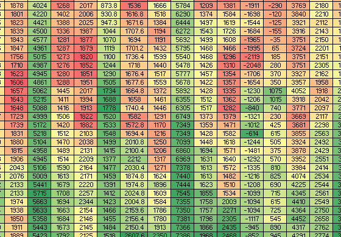

# Scrape-Stocks-Prices-And-Track-Daily
Python code to scrape stocks prices from moneycontrol.com and update the same in an excel sheet daily.

## Screenshot

## Usage:
1. update "todayRow" variable accordingly
